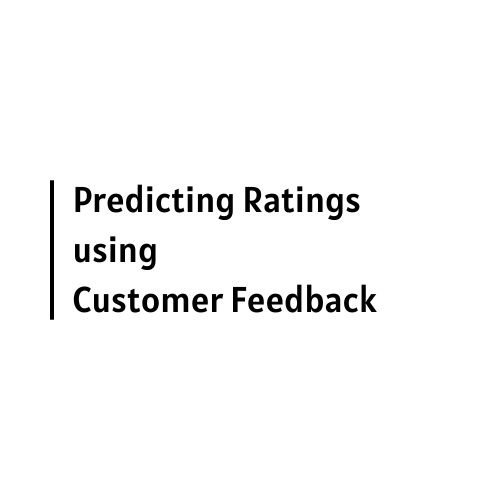

# Parallelizing Predicting Ratings using Customer Feedback

## Introduction

Online shopping has witnessed a surge in popularity in recent years. With the global e-commerce sales projected to reach 6.3 trillion by 2023, understanding customer feedback becomes paramount. This project aims to leverage customer feedback to predict item ratings using a parallelized approach.

## Objective

The primary objective is to develop a parallelized method to predict item ratings using customer feedback. This involves performing sentiment analysis on the review text and leveraging that to predict ratings for unseen reviews.

## Key Benefits

- **NLP-based Analysis**: Enables data-driven decision-making by providing insights into customer sentiment.
- **Proactive Issue Addressing**: By understanding customer feedback, businesses can address issues faced by customers.
- **Improved Product Performance**: Predicting customer ratings allows businesses to make informed decisions to enhance their product or service.

## Approach

### Dataset

The project utilizes the Multilingual Amazon Reviews Corpus dataset, which contains reviews in multiple languages collected from 2015 to 2019.

### Data Preparation & Pre-Processing

Data preparation involved combining the review headline and body to consolidate relevant information. Reviews were truncated to 4,000 characters to manage long-range dependencies. Infrequent words were filtered out to reduce noise.

### Models and Techniques

1. **TF-IDF + Multi Layer Perceptron**
2. **Word2Vec + Random Forest Classifier**
3. **WordPiece Tokenizer(BERT) + Bi-Directional LSTM**
4. **DistilBERT-Base + Neural Network**

## Experiments and Results

The project employed various frameworks like PySpark, PyTorch, and TensorFlow for model training. The performance of each model was evaluated based on training and inference times, both with and without parallelism.

## Customer Feedback Flow in Online Shopping

The diagram showcases the following steps:
1. **Online Shopping Popularity**: The rise in online shopping trends.
2. **Customer Feedback Importance**: The significance of understanding customer feedback.
3. **Sentiment Analysis**: Analyzing the sentiment behind customer reviews.
4. **Rating Prediction**: Predicting product ratings based on sentiment analysis.
5. **Business Decision Making**: Making informed decisions based on predicted ratings.
6. **Improved Product Performance**: Enhancing products or services based on insights.

## Conclusion

The project demonstrated the effectiveness of advanced machine learning models for multi-class text classification. Parallelizing the prediction process optimized the process, making it especially beneficial for industries like e-commerce and marketing.

## Future Scope

- **Balancing the Dataset**: Using re-sampling methods like SMOTE to reduce bias.
- **Incorporating Additional Features**: Including helpful votes and total votes to enhance model performance.
- **Utilizing Multi-GPU Architecture**: For PyTorch and a multi-node setup for Spark to reduce training time.
